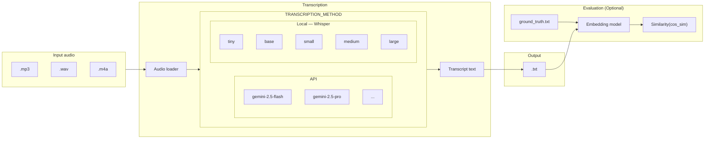
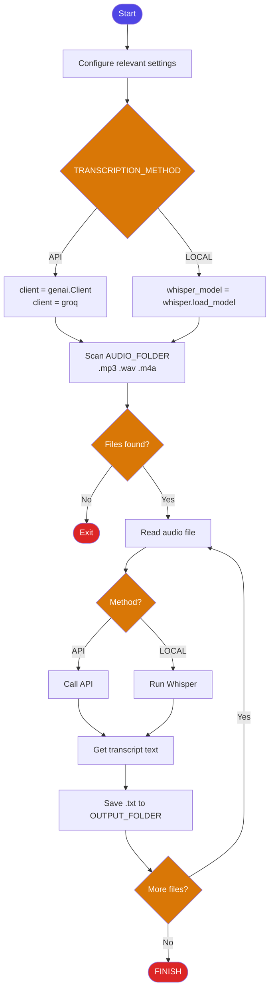

# Quickstart 
1. Install dependencies
```
pip install -r requirements.txt
```
2. Set up  `.env `
```
LLM_API_KEY_gemini=
LLM_API_KEY_groq=
```
3. Place your audio files

Put your files (.mp3, .wav, .m4a) into the audio_sample folder (or the folder path set in AUDIO_FOLDER).
4. Run  `download_whisper.py ` if you haven't downloaded a model yet
```
python download_whisper.py
```
5. Configure  `config.py `
```
TRANSCRIPTION_METHOD = "api"         # "api" (Gemini) or "local" (Whisper)
WHISPER_MODEL = "medium"             # tiny, base, small, medium, large
AUDIO_LANGUAGE = "zh"               
OUTPUT_LANGUAGE = "en"              

# Path settings
AUDIO_FOLDER= os.path.join(_base_dir, "input_audio")
OUTPUT_FOLDER= os.path.join(_base_dir, "transcribed_text")
COMPRESSED_FOLDER=os.path.join(_base_dir,"compressed_audio")
GROUND_TRUTH_PATH= os.path.join(_base_dir, "test_model", "ground_truth.txt")

API_TYPE = "groq"                                                           #Groq or Gemini
LLM_API_KEY_gemini= os.getenv("LLM_API_KEY_gemini")
LLM_MODEL_gemini= "gemini-2.5-flash"                                        #Change model if needed
LLM_API_KEY_groq= os.getenv("LLM_API_KEY_groq")
LLM_MODEL_groq= "whisper-large-v3-turbo"                                    #Change model if needed
```
6. Run

**Option A — Command line**
```
python main.py
```

**Option B — Web UI**

Start the server and open `http://127.0.0.1:8000` in your browser.
```
uvicorn app:app --reload
```
Settings (method, model, language) can be changed on the Settings page without restarting the server.

> **Note:** If you did not set API keys in `.env`, you can enter them on the Settings page in the web UI. Keys entered via the UI are session-only and will be lost on server restart.
# Notice
## Semantic similarity testing
The code includes a tool to compare your transcription results with a "Ground Truth" text file to calculate accuracy.

1. Place your reference text in test_model/ground_truth.txt.
  
2. To enable testing during the main run, uncomment the "test model section" at the bottom of 'main.py'.

3. Alternatively, run the comparison script directly:
```
python semantic_similarity.py
```
# Architecture diagram

# Flowchart

